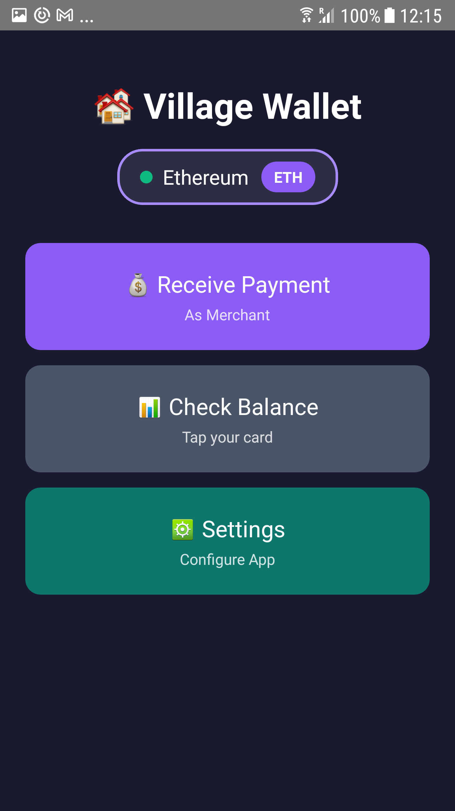
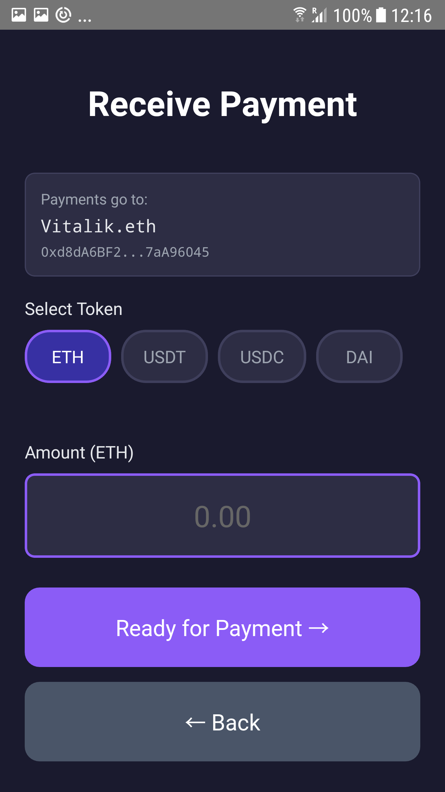
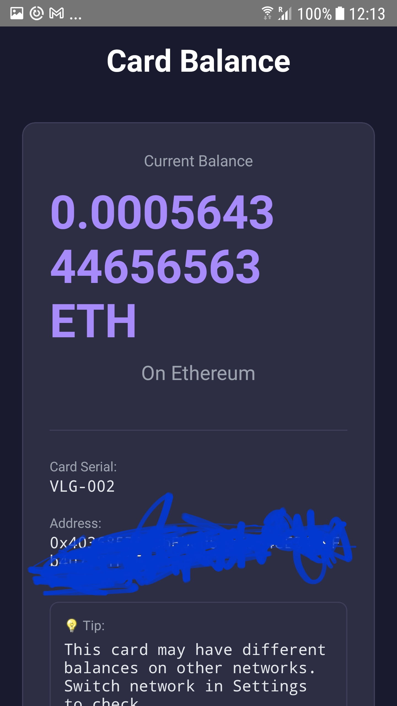

# 🐘 Village Wallet

**Open-source NFC crypto cards for Ethereum and beyond**

> A beautiful, multi-network crypto wallet with tap-to-pay NFC card support

[](https://opensource.org/licenses/MIT)
[](https://github.com/satoshistackalotto/village-wallet)
[](https://reactnative.dev/)
[](https://github.com/satoshistackalotto/village-wallet/releases)
[](https://github.com/satoshistackalotto/village-wallet/stargazers)

---

## 🎯 What is Village Wallet?

Village Wallet turns any NFC card into a secure crypto wallet. It's like a hardware wallet, but simpler and cheaper. Tap your card to pay with crypto just like contactless payment - but with USDT, USDC, ETH, and more!

### ✨ Key Features

#### 💳 **Multi-Token Support**
- 📱 **Tap to pay** - Just tap your card on any NFC-enabled phone
- 🪙 **Native Tokens:** ETH, MATIC, BNB, and more
- 💵 **Stablecoins:** USDT, USDC, DAI
- 💰 **Pay with any token** on any supported network!

#### 🌍 **6 Networks Supported**
- 🟣 **Polygon** - Low fees, fast transactions
- 🔵 **Arbitrum** - Ethereum L2 scaling
- ⚫ **Ethereum** - Main network
- 🔷 **Base** - Coinbase's L2
- 🔴 **Optimism** - Optimistic rollup
- 🟡 **BNB Chain** - Binance network

#### 🎴 **NFC Card Integration**
- 🔒 **PIN protected** - Your funds are secure with a 4-6 digit PIN
- 💾 **Secure offline storage** - Private keys encrypted on card
- 🎨 **Any card serial format** - Full customization support
- 🦊 **MetaMask ready** - Import your wallet anytime

#### 🏷️ **ENS Support**
- 📛 **Human-readable names** (alice.eth, user.village.eth)
- 🔄 **Auto-resolves** to Ethereum addresses
- 🎯 **Display ENS names** throughout the app

#### 🎨 **Beautiful Dark Mode UI**
- 🌙 **Modern navy + purple theme**
- 🟢/🔴 **Network status indicators**
- 🏷️ **Token selector with badges**
- 💲 **USD price estimates**

#### 🔐 **Security Features**
- 💻 **100% open source** - Audit the code, fork the project
- 🔐 **AES-256 encryption** - Military-grade security
- 🚫 **No servers** - Fully decentralized
- 🎁 **Perfect for gifts** - Give crypto in physical form

---

## 📱 Screenshots

<p align="center">
  
  
  
</p>

---

## 🚀 Quick Start

### For Users (Just want to use it)

1. **Download the app**
   - [Android APK](https://github.com/satoshistackalotto/village-wallet/releases/latest)
   - iOS: Coming soon

2. **Generate a wallet**
   - Open our [Card Generator](https://village-wallet.com/generator.html) (runs offline)
   - Enter card number and PIN
   - **Save your private key!** (for MetaMask backup)

3. **Write to NFC card**
   - Copy the JSON output
   - Use [NFC Tools](https://play.google.com/store/apps/details?id=com.wakdev.wdnfc) app
   - Write → Add Record → Text → Paste JSON

4. **Use your card**
   - Tap card to check balance (no PIN needed)
   - Tap card + enter PIN to pay
   - Import to MetaMask with your private key

### For Developers (Want to fork/contribute)

#### Prerequisites
- Node.js 16+
- React Native CLI
- Android Studio (for Android)
- Xcode (for iOS - optional)

#### Installation

```bash
# Clone the repository
git clone https://github.com/satoshistackalotto/village-wallet.git
cd village-wallet

# Install dependencies
npm install

# Install iOS dependencies (Mac only)
cd ios && pod install && cd ..

# Run on Android
npx react-native run-android

# Run on iOS (Mac only)
npx react-native run-ios
```

#### Build Production APK

```bash
cd android
./gradlew assembleRelease

# APK location:
# android/app/build/outputs/apk/release/app-release.apk
```

See [Fork Guide](https://github.com/satoshistackalotto/village-wallet/blob/main/village%20wallet%20files/docs/Fork%20Guide.md) for detailed customization instructions.

---

## 📖 How It Works

```
┌──────────────────────────────────────────────────────────┐
│  1. Generate Wallet (Offline)                           │
│     • Create Ethereum keypair                            │
│     • Encrypt private key with PIN (AES-256)             │
│     • Output: Public address + Encrypted key             │
└──────────────────────────────────────────────────────────┘
                          ↓
┌──────────────────────────────────────────────────────────┐
│  2. Write to NFC Card                                    │
│     • Card contains: Address + Encrypted key + Serial    │
│     • User keeps PIN separately                          │
│     • Private key never exposed                          │
└──────────────────────────────────────────────────────────┘
                          ↓
┌──────────────────────────────────────────────────────────┐
│  3. Use the Card                                         │
│     • Check balance: Just tap (no PIN)                   │
│     • Send payment: Tap + enter PIN                      │
│     • App decrypts key temporarily to sign transaction   │
│     • Key immediately cleared from memory                │
└──────────────────────────────────────────────────────────┘
```

### Security Model

**How It Works:**

1. **Card Creation:**
   - Private key generated offline (air-gapped)
   - Encrypted with PIN using AES-256
   - Written to NFC card with card serial

2. **Payment Flow:**
   - Card tapped → encrypted key read
   - User enters PIN → key decrypted in memory
   - Transaction signed → broadcasted to network
   - Key immediately cleared from memory

3. **What's Stored:**
   - **On Card:** Encrypted private key, public address, serial number, ENS name
   - **In App:** Merchant address (optional), network preference
   - **Not Stored:** Private keys, PINs, transaction history

**Security Features:**
- ✅ Generate wallets offline (air-gapped)
- ✅ Encrypt private keys with user PIN
- ✅ Never store or transmit keys
- ✅ Use standard cryptography (AES-256-CBC)
- ✅ Open source code (audit anytime)
- ✅ No servers, no APIs, no tracking

---

## 📖 Usage Guide

### For Merchants

1. **Setup:**
   - Open Settings
   - Enter your wallet address or scan your NFC card
   - Select preferred network and token (USDT, USDC, etc.)

2. **Receive Payment:**
   - Tap "Receive Payment"
   - Select token (USDT, USDC, ETH, MATIC, etc.)
   - Enter amount in USD or crypto
   - Customer taps their card and enters PIN
   - Transaction complete! ✅

### For Card Users

1. **Check Balance:**
   - Tap "Check Balance"
   - Place card on phone
   - View balance across all tokens and networks

2. **Make Payment:**
   - Merchant initiates payment request
   - Tap your card on merchant's phone
   - Enter your PIN
   - Confirm transaction details
   - Payment sent!

### Best Practices

#### What Users Should Do:
- ⚠️ **Keep PIN secret** (like a bank card)
- ⚠️ **Save private key offline** (for backup/recovery)
- ⚠️ **Don't scratch off card back** unless needed
- ⚠️ **Start with small amounts** for testing
- ⚠️ **Use stablecoins** for predictable pricing
- ⚠️ **Keep native tokens** for gas fees (ETH, MATIC, BNB)

---

## 🌍 Supported Networks & Tokens

### Networks

| Network | Symbol | Gas Token | Status | Features |
|---------|--------|-----------|--------|----------|
| Ethereum | ETH | ETH | ✅ Supported | Main network |
| Polygon | MATIC | MATIC | ✅ Supported | Low fees, fast |
| Arbitrum | ETH | ETH | ✅ Supported | Ethereum L2 |
| Base | ETH | ETH | ✅ Supported | Coinbase L2 |
| Optimism | ETH | ETH | ✅ Supported | Optimistic rollup |
| BNB Chain | BNB | BNB | ✅ Supported | Binance network |

### Supported Tokens

**Stablecoins:**
- USDT (Tether)
- USDC (USD Coin)
- DAI (Dai Stablecoin)

**Native Tokens:**
- ETH (Ethereum)
- MATIC (Polygon)
- BNB (Binance Coin)

Want to add a network or token? See [Contributing](#-contributing)

---

## 🛠️ Technical Details

### Tech Stack
- **Framework:** React Native 0.72-0.82
- **Blockchain:** Ethers.js v5.7.2
- **NFC:** react-native-nfc-manager
- **Encryption:** crypto-js (AES-256-CBC)
- **Networks:** Ethereum, Polygon, Arbitrum, Base, Optimism, BNB

### NFC Card Format

Cards store data in JSON format on NFC NDEF:

```json
{
  "v": "1.0",
  "net": "ethereum",
  "addr": "0x742d35Cc6634C0532925a3b844Bc9e7595f0bEB2",
  "ekey": "U2FsdGVkX1+vupppqqWvj3mbjPXYq...",
  "serial": "VLG-001",
  "ens": "alice.village.eth"
}
```

**Fields:**
- `v` - Format version (currently 1.0)
- `net` - Default network (ethereum, polygon, arbitrum, etc.)
- `addr` - Ethereum address (public key)
- `ekey` - AES-256 encrypted private key
- `serial` - Card serial number (any custom format)
- `ens` - ENS name (optional)

Full specification: [NFC Format Specification](https://github.com/satoshistackalotto/village-wallet/blob/main/village%20wallet%20files/docs/Fork%20Guide.md)

### Encryption Details

- **Algorithm:** AES-256-CBC (via CryptoJS)
- **Passphrase format:** `{serial}-PIN{pin}-SECURE`
- **Example:** `VLG-001-PIN1234-SECURE`
- **Key derivation:** PBKDF2 (built into CryptoJS)

---

## 📚 Documentation

- [User Guide](docs/index.html) - How to use Village Wallet
- [FAQ](docs/FAQ.md) - Common questions and answers
- [Fork Guide](docs/FORK-GUIDE.md) - Customize for your needs
- [NFC Format Spec](docs/NFC-FORMAT-SPEC.md) - Card format details
- [API Documentation](docs/API.md) - For developers

---

## 🔒 Security

### Security Audit

We welcome security researchers to audit our code. Found a vulnerability? Please email: security@village-wallet.com

### What We Guarantee

- ✅ Private keys encrypted with AES-256
- ✅ PIN never stored or transmitted
- ✅ Decryption happens locally on device
- ✅ Keys cleared from memory after use
- ✅ No servers, no APIs, no tracking
- ✅ Fully open source for auditing

### What We Don't Control

- ❌ Your PIN security
- ❌ Your private key backups
- ❌ Physical card security
- ❌ Network gas fees
- ❌ Token price volatility

---

## 🗺️ Roadmap

### ✅ Phase 1: MVP (Complete!)
- [x] Android app
- [x] Multi-network support (6 networks)
- [x] Multi-token support (ETH, USDT, USDC, DAI, MATIC, BNB)
- [x] Card generator (offline)
- [x] NFC integration
- [x] ENS support
- [x] Basic documentation

### 🚧 Phase 2: Polish (In Progress)
- [ ] iOS app
- [ ] Better UI/UX improvements
- [ ] Video tutorials
- [ ] Live price feeds (CoinGecko API)
- [ ] Transaction history
- [ ] QR code support
- [ ] Biometric authentication

### 🔮 Phase 3: Advanced Features
- [ ] ENS subdomain integration (user.village.eth)
- [ ] Multi-sig support
- [ ] Hardware wallet integration
- [ ] More tokens (WETH, WBTC, etc.)
- [ ] DeFi features (swap, stake)
- [ ] Multi-language support
- [ ] Light mode theme

### 🌟 Phase 4: Ecosystem
- [ ] Card marketplace
- [ ] White-label solutions
- [ ] DAO governance
- [ ] Grant program
- [ ] Developer SDK
- [ ] Physical card production partnerships

---

## 🤝 Contributing

We welcome contributions! Here's how you can help:

### For Non-Developers
- 🐛 **Report bugs** in [Issues](https://github.com/satoshistackalotto/village-wallet/issues)
- 💡 **Suggest features** in [Discussions](https://github.com/satoshistackalotto/village-wallet/discussions)
- 📖 **Improve documentation**
- 🌍 **Translate the app**
- ⭐ **Star the repo!**
- 📣 **Spread the word**

### For Developers
- 🔧 **Fix bugs**
- ✨ **Add features**
- 🧪 **Write tests**
- 📱 **Port to iOS**
- 🌐 **Add new networks**
- 🪙 **Add new tokens**

### How to Contribute

1. Fork the project
2. Create your feature branch (`git checkout -b feature/AmazingFeature`)
3. Commit your changes (`git commit -m 'Add some AmazingFeature'`)
4. Push to the branch (`git push origin feature/AmazingFeature`)
5. Open a Pull Request

See [CONTRIBUTING.md](CONTRIBUTING.md) for detailed guidelines.

---

## 💰 Support the Project

Village Wallet is free and open source. If you find it useful, consider supporting development:

### Ways to Support

- ⭐ **Star this repo** - Helps with visibility and motivation
- 💬 **Spread the word** - Tell your crypto friends
- 💰 **Donate crypto:**
  - Ethereum: `0xYourAddress`
  - Polygon: `0xYourAddress` (same address, cheaper fees!)
  - Arbitrum: `0xYourAddress`
- 🎁 **GitHub Sponsors:** [Sponsor us](https://github.com/sponsors/satoshistackalotto)

### Where Your Support Goes

All donations go toward:
- ⏱️ Development time
- 💻 Infrastructure costs
- 🎓 Community support
- ✨ New features
- 📚 Documentation
- 🎨 Design improvements

---

## 📜 License

This project is licensed under the MIT License - see the [LICENSE](LICENSE) file for details.

**What this means:**
- ✅ Use commercially
- ✅ Modify the code
- ✅ Distribute it
- ✅ Sublicense it
- ✅ Use privately

**Just:**
- 📄 Include the original license
- 🚫 Don't hold us liable

**TL;DR:** Do whatever you want with it, just give credit and don't sue us.

---

## 🙏 Acknowledgments

### Built With

- [React Native](https://reactnative.dev/) - Mobile framework
- [Ethers.js](https://docs.ethers.io/) - Ethereum library
- [react-native-nfc-manager](https://github.com/revtel/react-native-nfc-manager) - NFC functionality
- [crypto-js](https://github.com/brix/crypto-js) - Encryption library
- [CoinGecko](https://www.coingecko.com/) - Price data (planned)

### Inspired By

- [Ledger Unplugged](https://bitcoingarden.org/ledger-unplugged-contactless-bitcoin-wallet/) (discontinued, RIP)
- [Satscard](https://satscard.com/) - Bitcoin NFC cards
- [Coinb.in](https://coinb.in/) - Bitcoin transaction builder
- Physical crypto notes and paper wallets
- [xEth-wallet-for-NFC](https://github.com/Omodaka9375/xEth-wallet-for-NFC) - Java/Solidity NFC implementation

### Networks & Tools

- Polygon Network
- Arbitrum
- Base (Coinbase L2)
- Optimism
- BNB Chain
- Ethereum Foundation

---

## 📞 Contact & Community

- 🌐 **Website:** [village-wallet.com](https://village-wallet.com)
- 💬 **Discord:** [Join our Discord](https://discord.com/channels/1427941983544147980)
- 🐦 **Twitter:** [@stack_lotto](https://x.com/stack_lotto)
- 📧 **Email:** [support@village-wallet.com](mailto:support@village-wallet.com)
- 🐛 **Issues:** [GitHub Issues](https://github.com/satoshistackalotto/village-wallet/issues)
- 💭 **Discussions:** [GitHub Discussions](https://github.com/satoshistackalotto/village-wallet/discussions)

---

## ⚠️ Disclaimer

Village Wallet is experimental software. Use at your own risk.

**Important:**
- ❌ Not financial advice
- ❌ No guarantees or warranties
- ❌ You control your keys (we can't help if lost)
- ❌ Test with small amounts first
- ❌ Not liable for any losses
- ❌ No customer support for lost funds

**Always:**
- ✅ Backup your private keys offline
- ✅ Keep your PIN secret and secure
- ✅ Start with small test amounts
- ✅ Verify everything yourself
- ✅ Understand the risks of crypto
- ✅ Keep cards secure like credit cards

This software is provided "as is", without warranty of any kind, express or implied. Users are solely responsible for securing their private keys, PINs, and funds.

---

## 🌟 Star History

[](https://star-history.com/#satoshistackalotto/village-wallet&Date)

---

## 🔗 Related Projects & Resources

### Similar Projects
- [Satscard](https://satscard.com/) - Bitcoin NFC cards by Coinkite
- [Coinkite Opendime](https://opendime.com/) - Bitcoin credit stick
- [Ledger Unplugged](https://bitcoingarden.org/ledger-unplugged-contactless-bitcoin-wallet/) - Discontinued NFC wallet
- [xEth-wallet-for-NFC](https://github.com/Omodaka9375/xEth-wallet-for-NFC) - Open source Ethereum NFC implementation

### Wallet Generation Tools
- [MyEtherWallet](https://www.myetherwallet.com/) - Ethereum wallet interface
- [Coinb.in](https://coinb.in/) - Bitcoin transaction builder
- [Bitaddress.org](https://bitaddress.org/) - Paper wallet generator (BIP38)

### NFC Resources
- [NFC Tools Android App](https://play.google.com/store/apps/details?id=com.wakdev.wdnfc)
- [NFC Tag Info](https://play.google.com/store/apps/details?id=com.nxp.taginfolite)
- [React Native NFC Manager Docs](https://github.com/revtel/react-native-nfc-manager)

### Ethereum & Web3
- [Ethereum.org](https://ethereum.org/) - Official Ethereum website
- [ENS Domains](https://ens.domains/) - Ethereum Name Service
- [Ethers.js Documentation](https://docs.ethers.io/)
- [EIP Standards](https://eips.ethereum.org/) - Ethereum Improvement Proposals

### Physical Crypto Products
- [Bitcoin Paper Wallets on Etsy](https://www.etsy.com/uk/market/bitcoin_wallet)
- [Crypto Cold Storage Cards](https://www.etsy.com/uk/listing/1659545615/)
- Physical bitcoin notes and hologram stickers

### Development Resources
- [React Native Documentation](https://reactnative.dev/docs/getting-started)
- [Solidity Documentation](https://docs.soliditylang.org/)
- [Web3.js Documentation](https://web3js.readthedocs.io/)

### Marketplaces
- [Etsy](https://www.etsy.com/) - Sell physical crypto products
- [eBay](https://www.ebay.com/) - Secondary marketplace
- [OpenSea](https://opensea.io/) - NFT marketplace (for future NFT integration)

### Security & Encryption
- [BIP38 Standard](https://github.com/bitcoin/bips/blob/master/bip-0038.mediawiki) - Password-protected private keys
- [BIP32 HD Wallets](https://github.com/bitcoin/bips/blob/master/bip-0032.mediawiki)
- [BIP39 Mnemonic](https://github.com/bitcoin/bips/blob/master/bip-0039.mediawiki)
- [CryptoJS Documentation](https://cryptojs.gitbook.io/docs/)

---

<div align="center">

**Made with ❤️ for the crypto community**

[Download](https://github.com/satoshistackalotto/village-wallet/releases/latest) • [Website](https://village-wallet.com) • [Discord](https://discord.com/channels/1427941983544147980) • [Twitter](https://x.com/stack_lotto) • [Donate](https://github.com/sponsors/satoshistackalotto)

**⭐ Star us on GitHub — it helps!**

</div>
